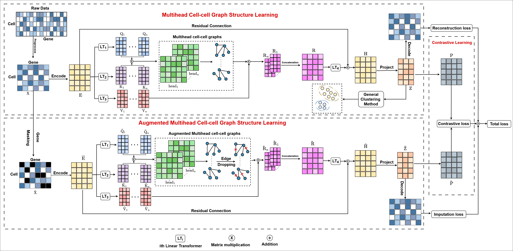

# scTGCL
A Transformer-Based Graph Contrastive Learning Approach for Efficiently Clustering Single-Cell RNA-seq Data



---

## 📦 Requirements

The project relies on the following Python packages (minimum tested versions):

- Python 3.8+
- torch (PyTorch) >= 1.9
- numpy >= 1.19
- pandas >= 1.1
- scanpy >= 1.8
- anndata >= 0.8
- scikit-learn >= 0.24
- scipy >= 1.6

> Install with `pip install -r requirements.txt`.

---

## 📁 Dataset

All of the processed datasets used for training and evaluation can be found at the following link:

[Processed datasets](https://zenodo.org/records/18864573)

---

## 🚀 Usage

Before training, you must preprocess the raw single-cell data. Use:

```bash
python preprocess.py --expr /path/to/raw_data.csv --labels /path/to/cell_label.csv --hvg 2500 --out /path/to/processed/dir
```

The script will read the raw expression matrix, perform filtering and normalization, and save the resulting AnnData object for downstream use.

Once preprocessing is complete, run the main training script with hyperparameters of your choice. An example command with the default configuration is:

```bash
python main.py --dataset .\data\pbmc.h5ad  --n_cluster 8  --embed_dim 512  --num_heads 8 --latent_dim 64  --dropout 0.3  --mask_prob 0.25  --attention_mask_prob 0.35 --lambda_recon 6 --lambda_impute 1 --lambda_contrast 0.8  --temperature 0.5 --lr 0.001 --weight_decay 1e-3 --epochs 100 --batch_size 128 --seed 42 --save_dir results
```

---
